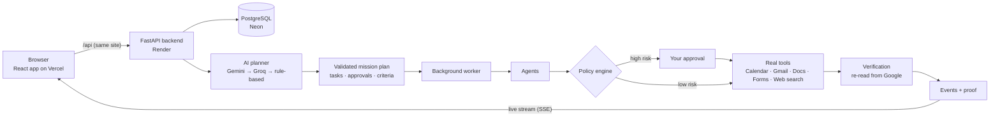

# AgentOS — Autonomous AI Workforce

**Give it a goal. AgentOS plans it, does the real work in your Google apps, asks before anything risky, and proves the result.**

> *"Don't tell AI what to do. Tell it what you want done."*

| | |
|---|---|
| **Live site** | **https://agent-os-two-iota.vercel.app**: sign up, connect your Google account, run real missions |
| **Repository** | https://github.com/ALN-web/AgentOS |
| **Stack** | React 18 + Vite (Vercel) · FastAPI + SQLAlchemy (Render) · PostgreSQL (Neon) · Gemini / Groq |

AgentOS turns an everyday goal into a **mission**:

1. an **AI planner** writes a plan of tasks;
2. **agents** carry the plan out with **real tools**: Google Calendar, Gmail, Google Docs, Google Forms and web search;
3. **you approve** every action that other people will see;
4. **verification** re-reads the results from Google before AgentOS calls the mission done.

## Contents

1. [Try it in 2 minutes](#try-it-in-2-minutes)
2. [What is real](#what-is-real)
3. [Safety](#safety)
4. [Architecture](#architecture)
5. [Setup](#setup):
   - [A. Demo Mode only](#a-demo-mode-only-2-minutes-no-accounts)
   - [B. Full Live Mode on your computer](#b-full-live-mode-on-your-computer-about-30-minutes)
   - [C. Deploy for free](#c-deploy-for-free)
6. [Troubleshooting](#troubleshooting)
7. [Testing](#testing)
8. [Project structure](#project-structure)
9. [Limitations](#limitations)

---

## Try it in 2 minutes

1. Open **https://agent-os-two-iota.vercel.app** and click **Get started — connect your Google**.
   - The backend runs on a free server. If nobody has used it for a while, the first load can take up to a minute; the page says so and retries by itself.
2. **Sign up** with any email and a password of 8 characters or more.
3. On the **Apps** page, click **Connect Google**.
   - Google shows **"Google hasn't verified this app"** because AgentOS is a student project. Click **Advanced → Go to AgentOS (unsafe)**.
   - **Tick every permission box**: Calendar, Gmail send, Drive (only files AgentOS creates), Forms. AgentOS can only touch the events, emails, documents and forms it creates.
4. Click **New mission** (Live Mode is preselected), or pick an example goal on the dashboard:

   | Goal | What happens for real |
   |---|---|
   | *"Coffee meeting with `<your email>` tomorrow at 10 am, send them the invite email"* | Checks your calendar, creates the event, sends the invitation email |
   | *"Find 5 software engineering internships for students in India and save a shortlist to a Google Doc"* | Searches the web (with sources), creates a Google Doc |
   | *"Create a registration form for our hackathon on Saturday"* | Creates a Google Form and returns its link |

5. AgentOS **pauses for your approval** before it creates or sends anything. You can **Approve**, **Edit** (change the time, recipients or text) or **Reject**.
6. When the mission completes, open the **proof links**: the real event, the sent email, the Doc or the Form in your own Google account.

You can disconnect Google at any time on the **Apps** page; AgentOS then revokes its access at Google.

Prefer not to sign in? **Try Demo** runs a scripted, fully simulated mission in the browser. It is labelled as simulated everywhere.

---

## What is real

| Capability | Live Mode (signed in) |
|---|---|
| Planning | **AI planner.** Gemini, with fallbacks across several Gemini models, then Groq, then a rule-based planner, so a plan always comes back. |
| Google Calendar | **Real.** Checks free time, creates and updates events in your timezone, and re-reads them to verify. |
| Gmail | **Real send.** The email is prepared in AgentOS and shown to you in the approval card (to, subject, body). It is sent with `gmail.send`, and Gmail's SENT confirmation is recorded. |
| Google Docs / Drive | **Real.** Creates documents. AgentOS can only access files it creates itself (`drive.file`). |
| Google Forms | **Real.** Creates forms and returns the responder link. |
| Web research | **Real.** `web.search` uses Gemini + Google Search, then Groq web search, then Wikipedia. Every finding comes with its source link. |
| Approvals | **Real.** A mission stops until you decide. Edits change exactly what is created or sent. |
| Verification | **Real.** Results are re-fetched from Google by id. The proof panel shows how each item was checked. |
| Steps without a real tool (e.g. a Discord post) | Run as a **clearly marked simulation**, never presented as done. |

---

## Safety

- **Approval before impact.** Any step that creates, sends or publishes something needs your approval:
  - the plan schema refuses plans that skip it;
  - the policy engine requires it for every high-risk tool, whatever the plan says.
- **Untrusted input.** Goals, emails, documents and web pages are treated as data, never as instructions. The AI only writes a plan, which is validated against the tool registry. Unknown tools are rejected. This is tested with injected "ignore previous instructions" text.
- **Accounts and isolation.**
  - Passwords are hashed with scrypt.
  - Sessions use an httpOnly SameSite cookie, stored only as a hash.
  - Every mission, approval and proof is visible only to its owner; other users get 404.
  - Cross-site writes are refused.
- **Google tokens.**
  - OAuth uses PKCE and a sealed, single-use `state` tied to the user.
  - Tokens are encrypted at rest (Fernet, with key rotation) and never sent to the browser or written to logs. A test scans every response, event and log line for them.
  - Scopes are minimal: `calendar.events`, `gmail.send`, `drive.file`, `forms.body`, `userinfo.email`.
- **Limits.**
  - Logins: 10 failed attempts per 5 minutes.
  - Per user: 30 AI plans and 20 new missions per hour.
  - Per mission: 30 tool calls.
  - Every external call has a timeout. Only transient errors are retried, and an email whose delivery is unknown is never re-sent.
- **Security headers** on the website and the API (HSTS in production).

Privacy policy: [/privacy.html](https://agent-os-two-iota.vercel.app/privacy.html) · Terms: [/terms.html](https://agent-os-two-iota.vercel.app/terms.html)

---

## Architecture



- **Frontend** (`src/`): React 18, Vite, Tailwind, React Flow.
  - Live missions stream their events over SSE (`src/live/`).
  - The same mission engine also powers the offline Demo (`src/engine/`, `src/agentos/`).
- **Backend** (`backend/app/`): FastAPI, SQLAlchemy 2, Alembic.
  - `services/planner.py`: AI planner with model and provider fallbacks.
  - `services/runner.py`: task-by-task execution, policy, approvals, retries, idempotency.
  - `services/worker.py`: background runs, so requests never wait on Google.
  - `tools/`: Calendar, Gmail, Drive, Forms and web tools, each with `execute` and an independent `verify`.
  - `services/verification.py`: proof bundles and re-verification.
- **Hosting** (all free tiers):
  - Vercel serves the website and forwards `/api` to Render, so cookies stay first-party;
  - Render runs the backend;
  - Neon hosts PostgreSQL.

---

## Setup

Pick one:

| Option | You get | Time | Accounts needed |
|---|---|---|---|
| **A. Demo Mode only** | The full UI with a simulated mission | 2 min | none |
| **B. Full Live Mode locally** | Real Calendar, Gmail, Docs, Forms and AI planning on your computer | ~30 min | Google Cloud (free), Gemini key (free) |
| **C. Deploy for free** | Your own public site like the live link | ~45 min | Vercel, Render, Neon (all free) |

### Prerequisites

| Tool | Version | Check with |
|---|---|---|
| [Git](https://git-scm.com/downloads) | any | `git --version` |
| [Node.js](https://nodejs.org/) | 18 or newer (tested on 22) | `node -v` |
| [Python](https://www.python.org/downloads/) | 3.11 or newer (3.12 recommended); only for options B and C | `python --version` |

### A. Demo Mode only (2 minutes, no accounts)

```bash
git clone https://github.com/ALN-web/AgentOS.git
cd AgentOS
npm install
npm run dev
```

Open **http://localhost:3000** and click **Try Demo Mission**. Everything runs in the browser; nothing is sent anywhere.

### B. Full Live Mode on your computer (about 30 minutes)

You will run two programs side by side:

- the **backend** on port **8000**;
- the **website** on port **3000**, which forwards `/api` to the backend.

#### Step 1: Get the code and install the website

```bash
git clone https://github.com/ALN-web/AgentOS.git
cd AgentOS
npm install
```

#### Step 2: Install the backend

```bash
cd backend
python -m venv .venv
```

Activate the virtual environment:

| OS | Command |
|---|---|
| Windows (PowerShell) | `.venv\Scripts\Activate.ps1` |
| Windows (Git Bash) | `source .venv/Scripts/activate` |
| macOS / Linux | `source .venv/bin/activate` |

Then install the dependencies:

```bash
pip install -r requirements-dev.txt
```

#### Step 3: Create a Google Cloud OAuth client (free)

This lets AgentOS act in **your** Google account after you sign in with Google.

1. Open **https://console.cloud.google.com** and create a project, e.g. `agentos`.
2. **APIs & Services → Library**: enable all four APIs:
   - **Google Calendar API**
   - **Gmail API**
   - **Google Drive API**
   - **Google Forms API**
3. **Google Auth Platform → Branding** (the OAuth consent screen):
   - App name `AgentOS`, your support email, your developer email.
   - **Audience:** *External*. While the app is in *Testing*, add every Google account you will use under **Test users**.
4. **Data access** (scopes): add these five:
   - `https://www.googleapis.com/auth/calendar.events`
   - `https://www.googleapis.com/auth/gmail.send`
   - `https://www.googleapis.com/auth/drive.file`
   - `https://www.googleapis.com/auth/forms.body`
   - `https://www.googleapis.com/auth/userinfo.email`
5. **Clients → Create client**:
   - Type: **Web application**.
   - **Authorised JavaScript origins:** `http://localhost:3000`
   - **Authorised redirect URIs:** `http://localhost:8000/api/integrations/google/callback`
   - Click **Create** and copy the **Client ID** and **Client secret**.

#### Step 4: Get the keys

1. **Encryption key** (protects stored Google tokens). Run this inside `backend/` with the virtual environment active:

   ```bash
   python -c "from cryptography.fernet import Fernet; print(Fernet.generate_key().decode())"
   ```

2. **Gemini API key** (AI planning and web search, free): https://aistudio.google.com/apikey → **Create API key**.
3. *Optional:* **Groq API key**, the backup AI provider (free): https://console.groq.com → **API Keys** → **Create API Key**.

#### Step 5: Create `backend/.env`

Create a file named `.env` inside the `backend/` folder. It is git-ignored; never commit it or share it.

```ini
AGENTOS_ENVIRONMENT=development
AGENTOS_FRONTEND_URL=http://localhost:3000
AGENTOS_GOOGLE_CLIENT_ID=<your client id>.apps.googleusercontent.com
AGENTOS_GOOGLE_CLIENT_SECRET=<your client secret>
AGENTOS_GOOGLE_REDIRECT_URI=http://localhost:8000/api/integrations/google/callback
AGENTOS_ENCRYPTION_KEY=<output of the command in step 4>
AGENTOS_LLM_API_KEY=<your Gemini key>
# optional backup AI provider
AGENTOS_LLM_FALLBACK_API_KEY=<your Groq key>
```

Without a database setting, the backend uses a local SQLite file (`backend/agentos.db`) and creates the tables automatically.

#### Step 6: Start the backend (terminal 1)

```bash
cd backend
# activate the virtual environment as in step 2, then:
uvicorn app.main:create_app --factory --reload --port 8000
```

Check it works: open **http://localhost:8000/api/health**. You should see `"database": "ok"` and `"live_mode": {"available": true, …}`. The interactive API docs are at http://localhost:8000/api/docs.

#### Step 7: Start the website in Live Mode (terminal 2)

From the repository root:

```bash
npm run dev:live
```

Open **http://localhost:3000**, then:

1. **Sign up** with any email and password; the account lives in your local database.
2. On **Apps**, click **Connect Google**, choose one of the test users from step 3, and tick every permission.
3. Click **New mission** (Live Mode) and try a goal, e.g. *"Coffee meeting with `<your email>` tomorrow at 10 am, send them the invite email"*.
4. Approve the steps, then open the proof links.

> `npm run dev` (without `:live`) is Demo Mode and never contacts the backend.

### C. Deploy for free

The public site uses:

- **Vercel** for the website, forwarding `/api` to Render;
- **Render** for the backend (`render.yaml` Blueprint);
- **Neon** for PostgreSQL.

Follow the step-by-step guide in **[docs/DEPLOY.md](docs/DEPLOY.md)**. In short:

1. **Neon:** create a project and copy its connection string.
2. **Render:** **New → Blueprint** → this repository. Fill in the secrets it asks for:
   - the database URL;
   - a **new** encryption key;
   - the Google client ID and secret;
   - your Gemini key, and optionally your Groq key.
3. **Vercel:** import the repository and set `VITE_AGENTOS_API_URL=/api`. If your Render address differs, update the `/api` rewrite in `vercel.json`.
4. **Google Cloud:**
   - add `https://<your-app>.vercel.app/api/integrations/google/callback` as a redirect URI and your Vercel domain as an authorised domain;
   - **Publish app**, so anyone can connect (up to 100 users before Google verification).
5. Keep the free backend awake: ping `https://<your-service>.onrender.com/api/health` every 5 minutes (e.g. with cron-job.org).

---

## Troubleshooting

| Problem | Fix |
|---|---|
| Google says **`redirect_uri_mismatch`** | The redirect URI in Google Cloud must match `AGENTOS_GOOGLE_REDIRECT_URI` exactly (scheme, port, path). |
| Google says **access blocked / not a test user** | Add your account under **Audience → Test users**, or publish the app. |
| **`/api/health` shows `live_mode.available: false`** | The client ID, client secret or encryption key is missing from `backend/.env`. Restart the backend after editing it. |
| **"This request did not come from AgentOS" (403)** | Open the site at the address in `AGENTOS_FRONTEND_URL` (default `http://localhost:3000`), not `127.0.0.1` or another port. |
| **Plan says "rule-based planner"** | No Gemini key, or its free quota is used up. Add `AGENTOS_LLM_API_KEY` (and a Groq key as backup). |
| **A mission pauses with "connect Google again"** | You connected before a newer permission existed. Go to **Apps → Reconnect Google** and tick every box. |
| **"The backend is not responding"** on the live site | The free server was asleep; wait up to a minute and the page retries by itself. |
| **Windows: `Activate.ps1` cannot be loaded** | Run `Set-ExecutionPolicy -Scope CurrentUser RemoteSigned` once, or use Git Bash. |
| **Port 3000 or 8000 already in use** | Stop the other program, or start Vite with `npm run dev:live -- --port 3100` and set `AGENTOS_FRONTEND_URL` to match. |

---

## Testing

```bash
npm test                         # 219 frontend tests (Vitest)
npm run build                    # production build
cd backend && python -m pytest   # 310 backend tests
```

The backend tests run complete missions against a fake Google. They cover:

- OAuth;
- approvals: approve, edit, reject and replay;
- verification;
- recovery;
- background runs;
- per-user isolation;
- prompt injection;
- secret scanning;
- rate limits;
- the AI planner and its fallbacks;
- web research.

GitHub Actions runs both suites, plus dependency audits, on every pull request.

---

## Project structure

```
AgentOS/
├── src/                    React app
│   ├── live/               Live Mode: API client, auth, event stream, Google connect
│   ├── app/                Console pages (dashboard, missions, mission detail, apps, approvals…)
│   ├── components/         Shared UI (approval card, new-mission dialog, …)
│   ├── engine/ agentos/    Mission engine and planner used by Demo Mode
│   └── landing/            Landing page
├── backend/
│   ├── app/
│   │   ├── api/            HTTP routes (auth, missions, approvals, integrations, health)
│   │   ├── services/       planner, runner, worker, verification, auth, preferences
│   │   ├── tools/          Calendar, Gmail, Drive, Forms, web search (execute + verify)
│   │   ├── policy/         permissions and risk rules
│   │   ├── integrations/   Google OAuth client
│   │   └── db/ schemas/    models and validated plan schema
│   ├── migrations/         Alembic migrations
│   └── tests/              pytest suite
├── docs/DEPLOY.md          Free deployment guide
├── render.yaml             Render Blueprint (backend)
└── vercel.json             Vercel config (website + /api rewrite)
```

---

## Limitations

- Google shows **"unverified app"** until Google reviews the app. Until then, up to 100 users can connect.
- The free backend sleeps after inactivity. The first request can take up to a minute; a 5-minute ping keeps it awake.
- Free AI quotas are shared by all users. When they run out, AgentOS falls back to another model or provider, and finally to the rule-based planner.
- Steps without a real tool (e.g. Discord posts or browser automation) are simulated and labelled as simulated.

## License

MIT License. © 2026 AgentOS.
